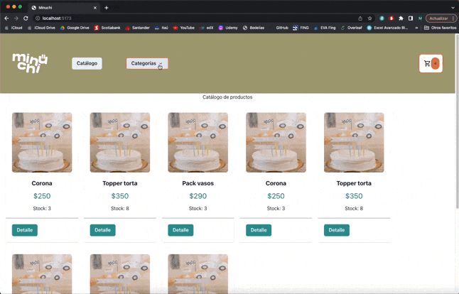

# Minuchi e-commerce
Este es el repositorio de Minuchi e-commerce elaborado para el proyecto del curso React Js (Comisión 39560) de CoderHouse.

Autor: Matías Brignoni [(LinkedIn)](https://www.linkedin.com/in/matiasbrignoni/)

## 2da Entrega
En esta entrega estoy teniendo dificultades para cargar las imagenes de los productos cuando hago el map. Probe poniendo las imagenes en la carpeta public y llamandolas directamente de ahí y no funciono.

Aún resta ajustar el CSS para que la estética del sitio sea más agradable.

** Debajo se encuentra el GIF solicitado para la 2da entrega



## Entrega Final

** Debajo se encuentra el GIF solicitado para la  entrega final, donde se quiere mostrar la experiencia del usuario en el ecommerce desarrollado.


## Tips propios
Para visualizar el sitio en el navegador debemos ejecutar **npm run dev** en la consola.

<!-- DEBAJO HAY EJEMPLOS DE COMO INSERTAR INFO EN EL README.md -->

<!-- **Negrita**
_Italic_ -->
<!-- 
```js
function sumar (){
    return resultado
}

``` -->

<!-- Puedo colocar una palabra reservada de Javascript para declarar variables `const` -->


<!-- |nombre|apellido|mail|
|---|---|---|
|aaa|aaa|aaa| -->
